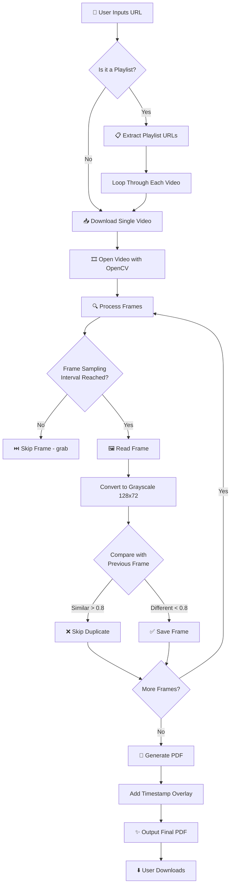
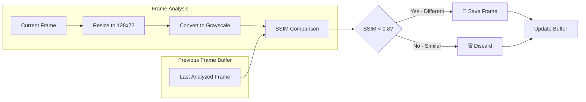
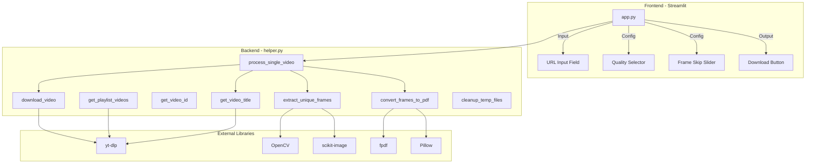
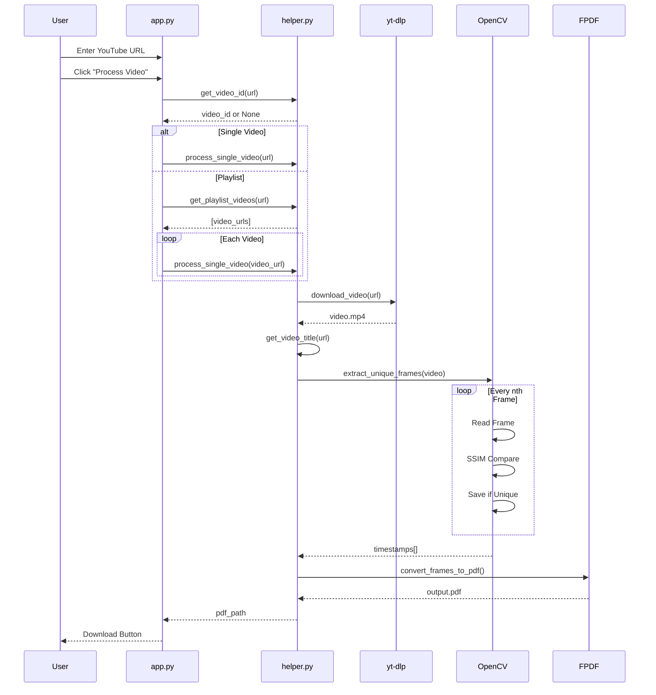
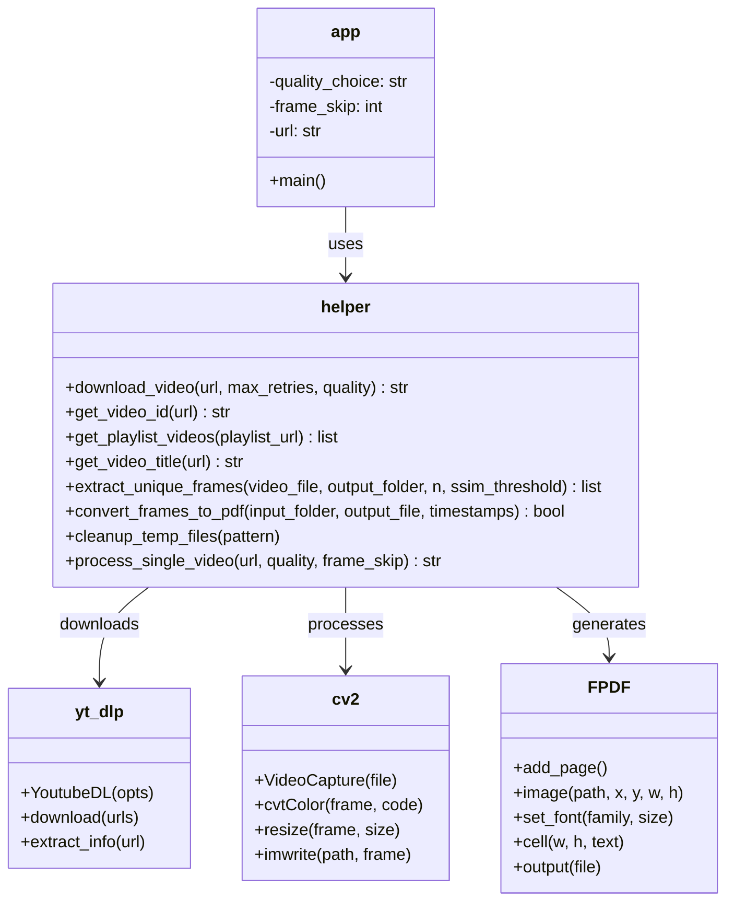
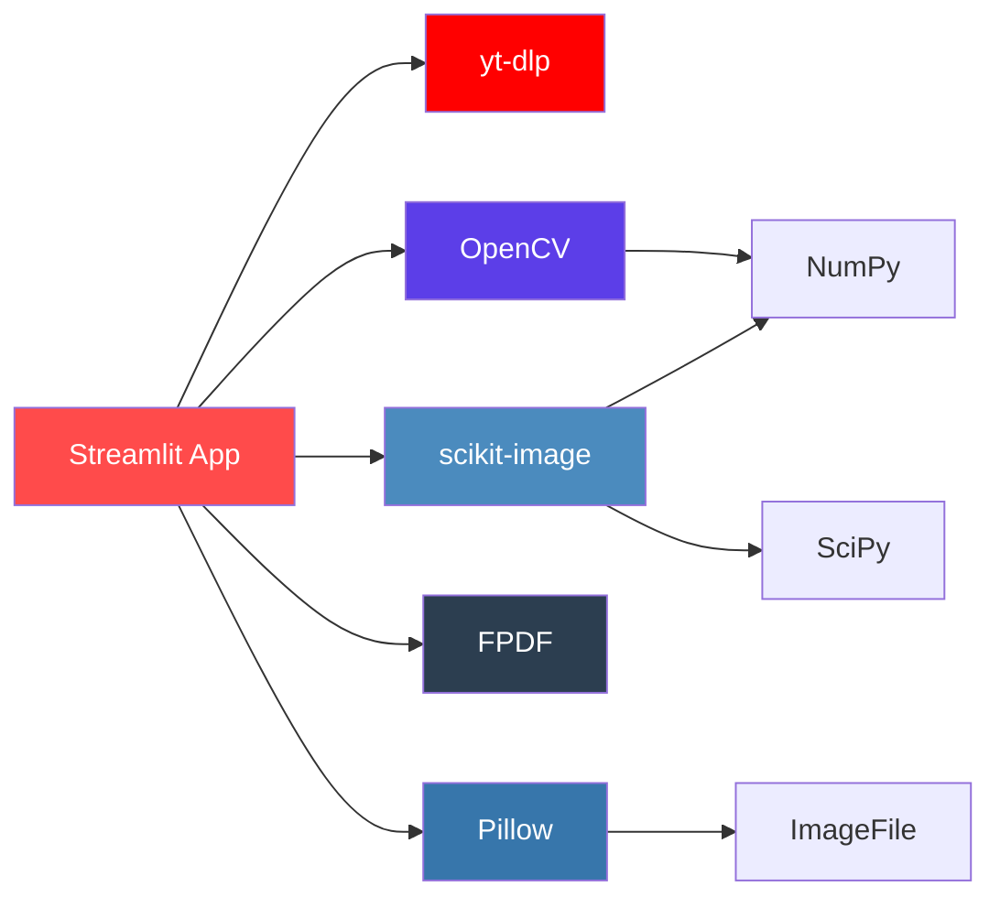

# 🎬 Glance Video - YouTube Frame Extractor


> **Transform YouTube videos into timestamped PDFs of unique frames** — perfect for lecture notes, movie summaries, and visual documentation.

---

## 📖 Table of Contents

- [🎬 Glance Video - YouTube Frame Extractor](#-glance-video---youtube-frame-extractor)
  - [📖 Table of Contents](#-table-of-contents)
  - [🎯 What is Glance Video?](#-what-is-glance-video)
  - [💡 The Problem It Solves](#-the-problem-it-solves)
  - [⚙️ How It Works](#️-how-it-works)
    - [High-Level Workflow](#high-level-workflow)
    - [Frame Deduplication Logic (SSIM)](#frame-deduplication-logic-ssim)
  - [✨ Features](#-features)
  - [🏗️ Architecture Overview](#️-architecture-overview)
    - [Component Diagram](#component-diagram)
    - [Data Flow Sequence](#data-flow-sequence)
    - [Class/Module Structure (UML)](#classmodule-structure-uml)
  - [🚀 Installation \& Setup](#-installation--setup)
    - [Prerequisites](#prerequisites)
    - [Step-by-Step Installation](#step-by-step-installation)
      - [1️⃣ Clone the Repository](#1️⃣-clone-the-repository)
      - [2️⃣ Create a Virtual Environment (Recommended)](#2️⃣-create-a-virtual-environment-recommended)
      - [3️⃣ Install Python Dependencies](#3️⃣-install-python-dependencies)
      - [4️⃣ Install System Dependencies (Linux Only)](#4️⃣-install-system-dependencies-linux-only)
      - [5️⃣ Verify Installation](#5️⃣-verify-installation)
      - [6️⃣ Run the Application](#6️⃣-run-the-application)
    - [Troubleshooting Installation](#troubleshooting-installation)
  - [📱 Usage Guide](#-usage-guide)
    - [Quick Start](#quick-start)
    - [Step-by-Step Instructions](#step-by-step-instructions)
    - [Supported URL Formats](#supported-url-formats)
  - [⚙️ Configuration Options](#️-configuration-options)
    - [Quality Modes](#quality-modes)
    - [Frame Skip Interval](#frame-skip-interval)
    - [SSIM Threshold (Advanced)](#ssim-threshold-advanced)
  - [📁 Project Structure](#-project-structure)
  - [🛠️ Tech Stack](#️-tech-stack)
    - [Dependency Graph](#dependency-graph)
  - [❓ Troubleshooting \& FAQ](#-troubleshooting--faq)
  - [🤝 Contributing](#-contributing)
    - [Development Setup](#development-setup)
    - [Areas for Improvement](#areas-for-improvement)
  - [📄 License](#-license)
  - [🙏 Acknowledgments](#-acknowledgments)

---

## 🎯 What is Glance Video?

**Glance Video** is a Streamlit-based web application that:

1. **Downloads** YouTube videos or entire playlists
2. **Analyzes** every frame using SSIM (Structural Similarity Index)
3. **Extracts** only the *unique* frames (skipping duplicate/near-identical ones)
4. **Generates** a professional PDF with each frame stamped with its timestamp

Think of it as a **"visual summary"** generator — instead of watching a 2-hour lecture, you get a 20-page PDF with the key visual moments.

---

## 💡 The Problem It Solves

| Scenario | Without Glance Video | With Glance Video |
|----------|---------------------|-------------------|
| 📚 **Study Notes** | Pause video, screenshot, repeat 100x | One-click PDF with all key frames |
| 🎥 **Content Review** | Re-watch entire video to find a scene | Timestamped frame index |
| 📝 **Documentation** | Manual screenshots of tutorials | Automated extraction of all steps |
| 🎞️ **Movie Analysis** | Frame-by-frame manual capture | Smart deduplication saves hours |

---

## ⚙️ How It Works

### High-Level Workflow



### Frame Deduplication Logic (SSIM)



> **What is SSIM?** Structural Similarity Index measures how visually similar two images are. A score of 1.0 means identical; below 0.8 typically indicates a meaningful visual change (scene transition, slide change, etc.).

---

## ✨ Features

| Feature | Description |
|---------|-------------|
| 🎯 **Smart Frame Detection** | SSIM-based comparison eliminates duplicate frames automatically |
| ⚡ **Speed/Quality Modes** | Choose 480p (fast) or original resolution (best quality) |
| 📊 **Live Progress Bars** | Real-time download, analysis, and PDF generation tracking |
| 🎵 **Playlist Support** | Process entire YouTube playlists (up to 1000 videos) |
| 🕐 **Timestamp Overlay** | Each frame stamped with HH:MM:SS for easy reference |
| 🎨 **Adaptive Text Color** | Timestamp color adapts to frame brightness for readability |
| 🔄 **Auto Retry Logic** | Multiple download strategies for YouTube's anti-bot measures |
| 🧹 **Auto Cleanup** | Temporary files removed after processing |
| 📱 **Responsive UI** | Clean Streamlit interface works on desktop and mobile |

---

## 🏗️ Architecture Overview

### Component Diagram



### Data Flow Sequence



### Class/Module Structure (UML)



---

## 🚀 Installation & Setup

### Prerequisites

Before you begin, ensure you have the following installed:

| Requirement | Version | Check Command |
|-------------|---------|---------------|
| **Python** | 3.10 or higher | `python --version` |
| **pip** | Latest | `pip --version` |
| **Git** | Any | `git --version` |
| **FFmpeg** | Latest | `ffmpeg -version` |

> **Note:** FFmpeg is required by yt-dlp for some video formats. Most systems have it, but if not, see the [FFmpeg installation guide](https://ffmpeg.org/download.html).

---

### Step-by-Step Installation

#### 1️⃣ Clone the Repository

```bash
git clone https://github.com/yourusername/glance_video.git
cd glance_video
```

#### 2️⃣ Create a Virtual Environment (Recommended)

**Windows:**
```bash
python -m venv venv
venv\Scripts\activate
```

**macOS/Linux:**
```bash
python3 -m venv venv
source venv/bin/activate
```

> ✅ You should see `(venv)` at the start of your terminal prompt.

#### 3️⃣ Install Python Dependencies

```bash
pip install -r requirements.txt
```

#### 4️⃣ Install System Dependencies (Linux Only)

If you're on Linux (including WSL), install the required system libraries:

```bash
sudo apt-get update
sudo apt-get install -y libgl1-mesa-glx libglib2.0-0
```

> **Why?** OpenCV requires these graphics libraries. The `packages.txt` file in this repo is used by Streamlit Cloud for automatic deployment.

#### 5️⃣ Verify Installation

```bash
python -c "import cv2, streamlit, yt_dlp, fpdf; print('✅ All dependencies installed!')"
```

#### 6️⃣ Run the Application

```bash
streamlit run app.py
```

The app will automatically open in your default browser at `http://localhost:8501`.

---

### Troubleshooting Installation

<details>
<summary><b>❌ "pip is not recognized"</b></summary>

Try using `python -m pip` instead:
```bash
python -m pip install -r requirements.txt
```
</details>

<details>
<summary><b>❌ OpenCV import fails on Linux</b></summary>

Install the missing system libraries:
```bash
sudo apt-get install -y libgl1-mesa-glx libglib2.0-0
```
</details>

<details>
<summary><b>❌ "No module named 'venv'"</b></summary>

Install the venv module:
```bash
# Ubuntu/Debian
sudo apt-get install python3-venv

# Fedora
sudo dnf install python3-venv
```
</details>

<details>
<summary><b>❌ yt-dlp download errors</b></summary>

Update yt-dlp to the latest version:
```bash
pip install -U yt-dlp
```

YouTube frequently changes its API, and yt-dlp releases updates to keep up.
</details>

---

## 📱 Usage Guide

### Quick Start

```
┌─────────────────────────────────────────────────────────────┐
│  🎬 YouTube Video to PDF Frame Extractor                    │
│  Extract unique frames from YouTube videos and create a     │
│  PDF with timestamps                                         │
├─────────────────────────────────────────────────────────────┤
│                                                              │
│  Enter the YouTube video or playlist URL:                   │
│  ┌─────────────────────────────────────────────────────┐    │
│  │ https://www.youtube.com/watch?v=dQw4w9WgXcQ         │    │
│  └─────────────────────────────────────────────────────┘    │
│                                                              │
│  ┌─────────────────────┐  ┌─────────────────────────────┐   │
│  │ Speed vs quality    │  │ Frame sampling interval     │   │
│  │ [Fast (480p) ▼]     │  │ [======●======] 3           │   │
│  └─────────────────────┘  └─────────────────────────────┘   │
│                                                              │
│  ┌─────────────────────────────────────────────────────┐    │
│  │           🚀 Process Video/Playlist                  │    │
│  └─────────────────────────────────────────────────────┘    │
│                                                              │
└─────────────────────────────────────────────────────────────┘
```

### Step-by-Step Instructions

| Step | Action | Notes |
|------|--------|-------|
| 1 | **Paste YouTube URL** | Supports videos, shorts, playlists, and live streams |
| 2 | **Select Quality** | "Fast" (480p) for quick processing, "Best" for original resolution |
| 3 | **Adjust Frame Skip** | Higher = faster but may miss quick changes (1-10) |
| 4 | **Click Process** | Watch live progress bars for download, analysis, and PDF generation |
| 5 | **Download PDF** | Click the download button to save your timestamped PDF |

### Supported URL Formats

```
✅ https://www.youtube.com/watch?v=VIDEO_ID
✅ https://youtu.be/VIDEO_ID
✅ https://www.youtube.com/shorts/VIDEO_ID
✅ https://www.youtube.com/playlist?list=PLAYLIST_ID
✅ https://www.youtube.com/live/VIDEO_ID
```

---

## ⚙️ Configuration Options

### Quality Modes

| Mode | Resolution | Use Case | Download Speed |
|------|------------|----------|----------------|
| **Fast** | 480p max | Quick previews, text-heavy content | ⚡ Fast |
| **Quality** | Original | Detailed visuals, presentations | 🐢 Slower |

### Frame Skip Interval

| Value | Frames Analyzed | Best For |
|-------|-----------------|----------|
| **1** | Every frame | Maximum detail (slow) |
| **3** | Every 3rd frame | Balanced (recommended) |
| **5** | Every 5th frame | Fast processing |
| **10** | Every 10th frame | Very fast, may miss changes |

### SSIM Threshold (Advanced)

The default threshold is `0.8`. Lower values = more frames saved; higher values = fewer frames.

To modify, edit `helper.py`:
```python
def extract_unique_frames(video_file, output_folder, n=3, ssim_threshold=0.8):
    # Change 0.8 to your preferred value (0.0 - 1.0)
```

---

## 📁 Project Structure

```
glance_video/
│
├── 📄 app.py                 # Main Streamlit application
│   ├── UI layout
│   ├── User input handling
│   └── Download button logic
│
├── 📄 helper.py              # Core functionality
│   ├── download_video()      # yt-dlp wrapper with retry logic
│   ├── get_video_id()        # URL parser
│   ├── get_playlist_videos() # Playlist extractor
│   ├── get_video_title()     # Metadata fetcher
│   ├── extract_unique_frames() # SSIM-based frame extraction
│   ├── convert_frames_to_pdf() # PDF generator
│   ├── cleanup_temp_files()  # Temp file management
│   └── process_single_video() # Orchestrator function
│
├── 📄 __init__.py            # Package marker
│
├── 📄 requirements.txt       # Python dependencies
├── 📄 packages.txt           # System dependencies (for Streamlit Cloud)
├── 📄 .gitignore             # Git exclusions
│
└── 📁 docs/                  # Documentation assets
    ├── Actual App.png        # Screenshot of the app
    └── output frame.png      # Sample output frame
```

---

## 🛠️ Tech Stack

| Component | Technology | Purpose |
|-----------|------------|---------|
| **Frontend** | [Streamlit](https://streamlit.io/) | Web UI framework |
| **Video Download** | [yt-dlp](https://github.com/yt-dlp/yt-dlp) | YouTube video/playlist downloading |
| **Video Processing** | [OpenCV](https://opencv.org/) | Frame extraction and manipulation |
| **Image Comparison** | [scikit-image](https://scikit-image.org/) | SSIM algorithm |
| **PDF Generation** | [FPDF](https://pyfpdf.github.io/) | PDF creation |
| **Image Handling** | [Pillow](https://python-pillow.org/) | Image processing |

### Dependency Graph



---

## ❓ Troubleshooting & FAQ

<details>
<summary><b>🔴 "Sign in to confirm you're not a bot"</b></summary>

This is YouTube's anti-bot measure. Solutions:

1. **Update yt-dlp:**
   ```bash
   pip install -U yt-dlp
   ```

2. **Clear cookies/cache** and try again

3. **Wait a few minutes** — YouTube rate-limits aggressive requests

4. **Try a VPN** if the issue persists
</details>

<details>
<summary><b>🔴 Download fails with HTTP 403</b></summary>

The video format is unavailable. Try:

1. Switch to "Best quality" mode
2. Update yt-dlp: `pip install -U yt-dlp`
3. Try a different video to confirm the app works
</details>

<details>
<summary><b>🔴 "No unique frames extracted"</b></summary>

Possible causes:

- Video is static (no visual changes)
- Frame skip is too high (lower the value)
- SSIM threshold is too low (all frames considered similar)

**Solution:** Lower the frame skip interval to 1 or 2.
</details>

<details>
<summary><b>🔴 PDF is too large</b></summary>

- Use "Fast" quality mode (480p)
- Increase frame skip interval
- Process shorter video segments
</details>

<details>
<summary><b>🔴 App is slow</b></summary>

Performance tips:

| Setting | Faster | Slower |
|---------|--------|--------|
| Quality | Fast (480p) | Best |
| Frame Skip | 10 | 1 |
| Video Length | Shorter | Longer |
| SSIM Threshold | Lower | Higher |
</details>

<details>
<summary><b>🔴 Playlist processing stops midway</b></summary>

- YouTube may rate-limit after many downloads
- Some videos may be private/deleted
- Check console output for specific errors

**Solution:** Process in smaller batches or wait between runs.
</details>

---

## 🤝 Contributing

Contributions are welcome! Here's how:

1. **Fork** the repository
2. **Create** a feature branch:
   ```bash
   git checkout -b feature/amazing-feature
   ```
3. **Commit** your changes:
   ```bash
   git commit -m "Add amazing feature"
   ```
4. **Push** to the branch:
   ```bash
   git push origin feature/amazing-feature
   ```
5. **Open** a Pull Request

### Development Setup

```bash
# Clone your fork
git clone https://github.com/YOUR_USERNAME/glance_video.git
cd glance_video

# Create virtual environment
python -m venv venv
source venv/bin/activate  # or venv\Scripts\activate on Windows

# Install dependencies
pip install -r requirements.txt

# Run in development mode
streamlit run app.py --server.runOnSave true
```

### Areas for Improvement

- [ ] Add support for Vimeo, Dailymotion
- [ ] Implement OCR for text extraction
- [ ] Add chapter detection
- [ ] Export to other formats (DOCX, HTML)
- [ ] Batch URL processing
- [ ] Docker containerization

---

## 📄 License

This project is licensed under the **MIT License** — see the [LICENSE](LICENSE) file for details.

```
MIT License

Copyright (c) 2026 Glance Video Contributors

Permission is hereby granted, free of charge, to any person obtaining a copy
of this software and associated documentation files (the "Software"), to deal
in the Software without restriction, including without limitation the rights
to use, copy, modify, merge, publish, distribute, sublicense, and/or sell
copies of the Software, and to permit persons to whom the Software is
furnished to do so, subject to the following conditions:

The above copyright notice and this permission notice shall be included in all
copies or substantial portions of the Software.
```

---

## 🙏 Acknowledgments

- [yt-dlp](https://github.com/yt-dlp/yt-dlp) — The backbone of video downloading
- [Streamlit](https://streamlit.io/) — Making web apps accessible to Python developers
- [OpenCV](https://opencv.org/) — Powerful computer vision toolkit
- [scikit-image](https://scikit-image.org/) — SSIM implementation
- All contributors and users who provide feedback

---

<div align="center">

**⭐ If this project helped you, please give it a star! ⭐**

[Report Bug](https://github.com/yourusername/glance_video/issues) · [Request Feature](https://github.com/yourusername/glance_video/issues) · [Documentation](https://github.com/yourusername/glance_video/wiki)

---

Made with ❤️ by the Glance Video Team

</div>